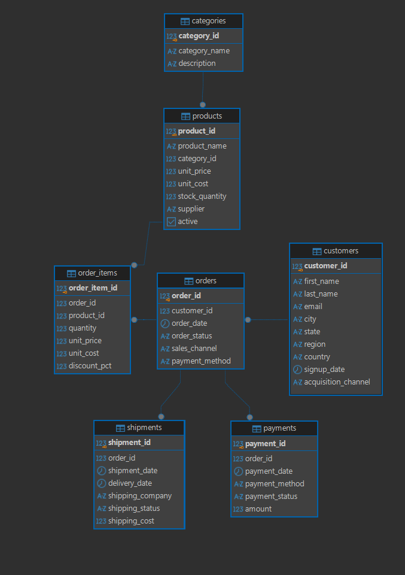

# E-commerce SQL Analysis

An end-to-end SQL data analysis project using PostgreSQL to explore e-commerce sales, customer behavior, product performance, and operational activity.

The project focuses on transforming relational transactional data into business insights through SQL queries, aggregations, joins, CTEs, window functions, and analytical calculations.

## 🎯 Project Objective

Analyze an e-commerce dataset to answer key business questions around:

- Sales performance and growth
- Product and category performance
- Customer purchasing behavior
- Sales channel performance
- Regional and acquisition trends
- Payment and shipping operations
- Profitability and commercial KPIs

The analysis was designed to simulate a real-world business intelligence workflow, from database creation and data validation to exploratory and business-focused analysis.

---

## 🗄️ Database Overview

The PostgreSQL database contains:

| Table | Records |
|---|---:|
| Customers | 100 |
| Categories | 8 |
| Products | 30 |
| Orders | 435 |
| Order Items | 1,089 |
| Payments | 435 |
| Shipments | 413 |

The database follows a relational structure connecting customers, orders, products, payments, and shipments.

---

## 📊 Key Business KPIs

Based on valid orders, excluding cancelled transactions:

| KPI | Value |
|---|---:|
| Valid Orders | 413 |
| Units Sold | 2,672 |
| Net Sales | $1,758,581.30 |
| Gross Profit | $882,226.30 |
| Gross Margin | 50.17% |
| Average Order Value | $4,258.07 |

Customer analysis identified:

- 100 total customers
- 25 one-time customers
- 75 repeat customers
- 75% repeat-customer rate

---

## 📈 Sales Analysis

The sales analysis examines monthly performance, month-over-month growth, sales channels, categories, and product-level performance.

### Monthly Performance

- Highest sales month: July 2026 — $230,232.10
- Lowest sales month: August 2025 — $10,908.00
- Highest MoM growth: September 2025 — 279.32%
- Largest MoM decline: September 2026 — -49.54%

### Sales Channels

Sales were analyzed across:

- Instagram
- Website
- App
- Tienda física
- Marketplace

### Category Performance

The analysis covers eight product categories:

- Moda
- Tecnología
- Belleza
- Hogar
- Deportes
- Mascotas
- Alimentos y Bebidas
- Papelería

### Top Products by Net Sales

1. Sudadera Essential
2. Perfume Urbano
3. Tapete Yoga
4. Audífonos Bluetooth
5. Mochila Urbana

---

## 👥 Customer Analysis

Customer behavior was analyzed using purchase frequency, customer value, region, and acquisition channel.

The analysis includes customer segmentation into:

- VIP
- High Value
- Regular
- Occasional

Additional analysis evaluates:

- Repeat purchase behavior
- Customer revenue contribution
- Regional performance
- Acquisition channels
- High-value customers

---

## 🚚 Operational Analysis

The project also evaluates payment and shipping operations.

### Payment Status

Transactions were classified into:

- Paid
- Refunded
- Pending

### Shipping

Shipping performance was analyzed by:

- Shipping company
- Shipping cost
- Average delivery time
- Delivered shipments
- In-transit shipments
- Preparing shipments

Shipping companies included:

- DHL
- FedEx
- Estafeta
- Paquetexpress

---

## 🧩 Entity Relationship Diagram

The database structure was designed and documented using an ER diagram.



---

## 🛠️ Tools & Technologies

- PostgreSQL
- SQL
- DBeaver
- GitHub

### SQL Techniques Used

- SELECT / WHERE
- JOINs
- GROUP BY
- CASE statements
- CTEs
- Subqueries
- Aggregate functions
- Window functions
- FILTER
- HAVING
- Date functions
- Conditional calculations
- Ranking
- Month-over-month analysis
- Customer segmentation
- Data validation

---

## 📁 Project Structure

```text
ecommerce-sql-analysis/
│
├── assets/
│   └── ecommerce_er_diagram.png
│
├── sql/
│   ├── 01_schema.sql
│   ├── 02_seed_data.sql
│   ├── 03_data_exploration.sql
│   ├── 04_sales_analysis.sql
│   └── 05_customer_analysis.sql
│
└── README.md
